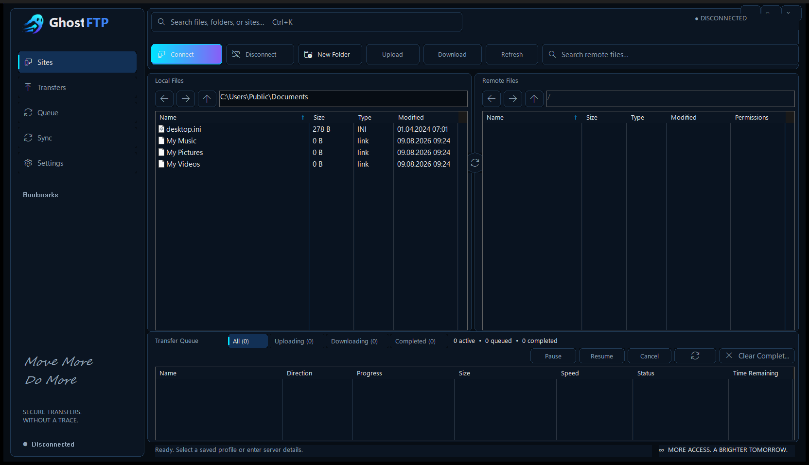
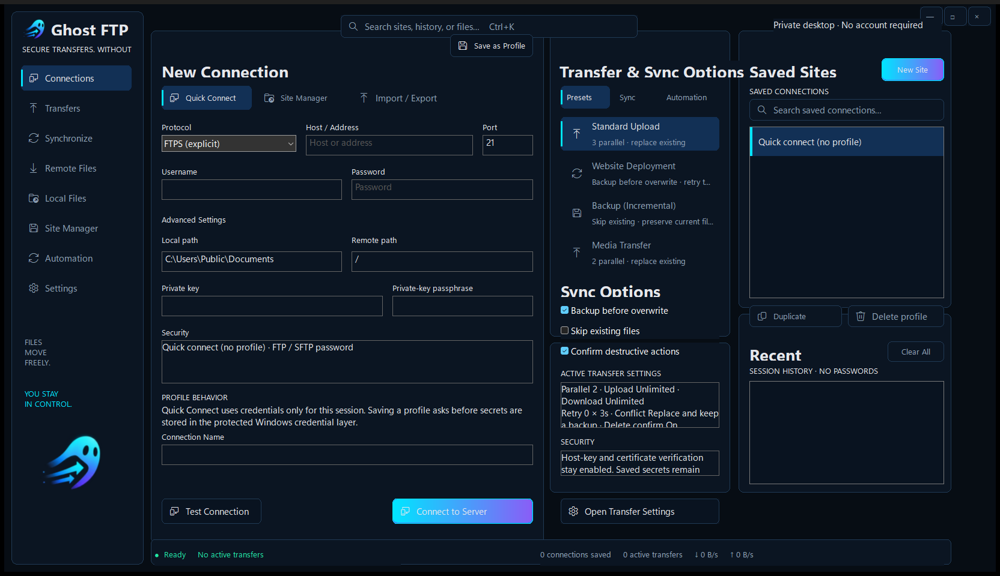
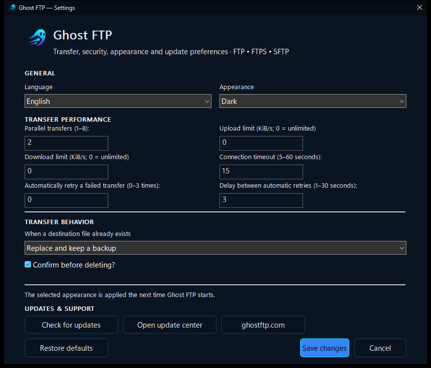

  

  <strong>Secure transfers. Without a trace.</strong> 
  A modern Windows FTP, FTPS and SFTP client built around a fast dual-pane workflow, clear security decisions and the approved Ghost FTP dark interface.

  
  
  
  
  

---

## Files move freely. You stay in control.

Ghost FTP is designed for people who work directly with servers and do not want a dated file-transfer workflow. The application combines familiar FTP tooling with a cleaner Windows-native experience: saved sites on the left, Local Files and Remote Files side by side, transfer status always visible, and security decisions shown where they matter.

  

### Built for the transfer work that actually happens

<table>
<tr>
<td align="center" width="25%">
 
<strong>Secure by design</strong> 
SFTP host-key verification, FTPS certificate validation and protected Windows credential storage.
</td>
<td align="center" width="25%">
 
<strong>Fast transfer workflow</strong> 
Upload, download, pause, resume, retry, cancel, queue priority, progress, speed and ETA.
</td>
<td align="center" width="25%">
 
<strong>Compare & synchronize</strong> 
Side-by-side directories, comparison results and synchronization helpers without hiding the underlying files.
</td>
<td align="center" width="25%">
 
<strong>Power-user ready</strong> 
Saved sites, bookmarks, remote editing, permissions, recursive search and keyboard-friendly navigation.
</td>
</tr>
</table>

## Connections that stay organized

The Connections workspace keeps quick access, saved sites and transfer behavior in one place. English is the primary product language and all operational copy is written for end users — no demo personas, development labels or placeholder account content is shipped in the interface.

  

### Connection workspace

- **Quick Connect** for one-time FTP, FTPS and SFTP sessions.
- **Site Manager** for protected saved profiles.
- **Import / Export** creates and reads real Ghost FTP site bundles containing connection metadata only. Stored passwords, private-key passphrases and trusted host fingerprints are never exported.
- **Transfer presets** apply real persisted settings for Standard Upload, Website Deployment, Backup (Incremental) and Media Transfer workflows.
- **Saved Sites** and private session-only **Recent Connections** reduce repetitive setup without persisting a second history database.
- **Transfer & Sync Options** surface real presets and sync safety controls — backup before overwrite, skip existing files and destructive-action confirmation — instead of decorative switches.

## A workspace built around your files

Ghost FTP 0.5.1 uses the approved charcoal/slate interface with cyan → electric-blue → violet accents and an integrated Ghost FTP wordmark.

The main workspace includes:

- Sites / Transfers / Queue / Sync / Settings navigation
- saved-site shortcuts directly in the application rail
- global **Ctrl+K** search entry point
- Connect / Disconnect / New Folder / Upload / Download / Refresh actions
- Local Files and Remote Files panes
- Name / Size / Type / Modified / Permissions file metadata
- independent local and remote navigation
- directory comparison and synchronization bridge
- Transfer Queue filters for All / Uploading / Downloading / Completed
- real Name / Direction / Progress / Size / Speed / Status / Time Remaining metrics
- pause, resume, retry, cancel, clear and queue-priority actions
- remote rename, delete, create-folder, edit and CHMOD support where the server permits it
- recursive search and bookmarks
- DPI-aware Windows layouts

## Settings that stay focused

Ghost FTP keeps frequently changed preferences in one branded Windows surface: language, appearance, parallel transfers, bandwidth limits, connection timeout, automatic retry behavior, conflict handling and update access.

  

The Settings UI contains only working product actions. There is no subscription upsell, demo account or development-only control in the production build. English is the default language, with Croatian and 22 additional maintained desktop languages available from Settings.

## Privacy without marketing theatre

Ghost FTP does not require a Ghost FTP account to connect to your servers. The maintained desktop client does not add advertising or product telemetry.

Saved credentials use the Windows protection layer. Sensitive passwords and passphrases are not intentionally written to application logs, and update checks do not include connection profiles, server credentials, local/remote paths, file names or transfer history.

## Verified updates

Ghost FTP uses the dedicated first-party update service:

`https://update.ghostftp.com/`

The desktop client checks:

`https://update.ghostftp.com/windows/latest.json`

A release manifest contains the expected SHA-256 for Setup, Portable and Update packages. The standalone updater accepts packages only from the HTTPS update host and verifies the Setup package before launch.

See **UPDATE_SERVICE.md** for the deployment contract.

## Windows downloads

Every production GitHub release publishes the same release set used by the update service:

| Artifact | Purpose |
| --- | --- |
| `Ghost-FTP-0.5.1-Setup.exe` | Standard Windows installation; uninstall is integrated into GhostFTP.exe via Windows Installed Apps, with no permanent Uninstall.exe |
| `Ghost-FTP-0.5.1-Portable.exe` | Portable build with no installer |
| `Ghost-FTP-0.5.1-Update.exe` | Verified first-party update helper |
| `Ghost-FTP-0.5.1-Source.zip` | Exact source package for the release |
| `SHA256.txt` | Release integrity manifest |
| `latest.json` | `update.ghostftp.com` client manifest |

## Release quality gates

A Windows release is not considered complete merely because the executable compiles. The GitHub Actions pipeline runs:

`gofmt` → `go vet` → full Go tests → deterministic brand assets → Portable/Setup/Update builds → PE metadata/resources → real Windows UI capture → source packaging → SHA-256 manifest → release publication.

This keeps the published binaries, source package, update manifest and repository version aligned.

## Product identity

| | |
| --- | --- |
| **Product** | Ghost FTP |
| **Tagline** | Secure transfers. Without a trace. |
| **Primary language** | English |
| **Protocols** | FTP, FTPS, SFTP |
| **Platform** | Windows 10 / 11 (the retired macOS application source is not shipped) |
| **Website** | https://ghostftp.com/ |
| **Update service** | https://update.ghostftp.com/ |
| **Repository** | `bren-wp/Host-FTP` |
| **License** | GNU GPL-3.0 |

---

   
  <strong>Ghost FTP</strong> 
  Move more. Do more. Transfer further.

